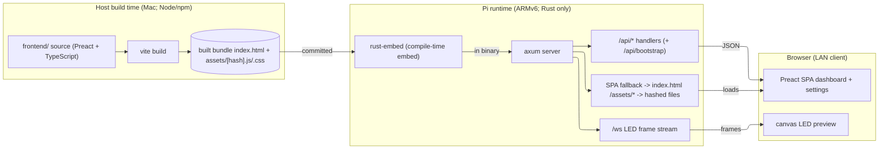

# Discovery: Preact SPA Frontend

<!-- spec-nav:start -->
**Spec navigation:** [State](00_state.md) · [Discovery](01_discovery.md) · [Requirements](02_requirements.md) · [Design](03_design.md) · [Tasks](04_tasks.md) · [Execution](05_execution.md)
<!-- spec-nav:end -->

## Problem and Outcome

MoodLightPi's web UI is a hand-rolled vanilla-JavaScript single-page app —
`web/index.html`, `web/app.js`, and
`web/style.css` — embedded into the Rust binary at compile time via
`rust-embed` ([`src/web.rs`](../../src/web.rs)). It hand-writes DOM manipulation, a bespoke
client-side router, manual `fetch` plumbing, and imperative state syncing across ~1,000 lines of
untyped JS. Adding or changing a control means editing three parallel files with no component
boundaries, no type safety against the API, and no build-time checks.

> There is no Askama (or any server-side templating) in this project. The original request
> described the frontend as "Askama"; the actual current stack is the vanilla-JS SPA above. The
> backend is already API-driven.

**Desired outcome:** replace the vanilla-JS frontend with a component-based **Preact + TypeScript**
SPA built by **Vite**, preserving 100% of today's features and the OctoCam-style layout, while
keeping the same embed-into-the-binary deployment model so the appliance stays a single
self-contained artifact. The backend stays API-driven; the API is cleaned up where the new
frontend makes a simpler contract obvious.

## Users and Current Workaround

- **Primary user:** the device owner, on a phone or laptop on the same LAN, opening
  `http://moodlightpi.local/` to control the light (power via effects, color, brightness, effect +
  speed) and watch a live canvas preview of the 8×4 LED panel.
- **Secondary user:** the same owner configuring the device — identity, Wi‑Fi, MQTT, HomeKit, SSH
  keys — and issuing system actions (restart service / reboot / poweroff).
- **Current workaround:** none needed functionally; the existing UI works. The pain is
  maintainability and extensibility of the untyped, three-file frontend, not a missing capability.

## Scope and Non-Goals

**In scope**

- New Preact + TypeScript SPA under a [`frontend/`](../../frontend) source tree, built with Vite (`preact-ts`).
- Feature and visual parity with the current UI (OctoCam-style layout), covering every control and
  network interaction inventoried below.
- A typed API client mirroring the existing endpoints, plus live LED preview over the `/ws`
  WebSocket rendered to a `<canvas>`.
- Build pipeline: Vite builds on the host into a committed bundle directory; `rust-embed` embeds
  that directory; axum serves it (SPA fallback for client routes, direct serve for hashed assets).
- Backend cleanup enabled by the new frontend: an aggregate bootstrap endpoint, replacing the
  enumerated `serve_index` routes with a catch-all SPA fallback, and pruning genuinely unused
  routes. Backend tests updated to match.
- **MQTT availability + Home Assistant integration (added 2026-08-16):** the device advertises its
  availability to the broker (an `online`/`offline` availability topic backed by an MQTT Last-Will)
  and publishes Home Assistant MQTT Discovery so the light auto-registers as an HA entity. The MQTT
  settings UI gains the corresponding configuration (availability topic, discovery enable +
  prefix).

**Non-goals (this spec)**

- No new *lighting* features (no new effects, no HomeKit QR code).
- No live MQTT broker-connection status shown in the UI (the device advertises its own availability
  to the broker per the scope above; the frontend does not additionally display broker
  connectivity).
- No visual redesign beyond parity; the OctoCam-style layout is preserved, not reimagined.
- No change to the engine, effects, persistence, hardware, or HomeKit runtime behavior. The MQTT
  runtime changes only to add availability advertising and HA discovery (above).
- No Node/npm requirement on the Pi. The frontend is built on the host only.

## Constraints and Success Measures

**Constraints**

- **Target device:** Raspberry Pi Zero W, ARMv6 (`armv6l`), Raspbian trixie. Rust is built
  *natively on the Pi* from a source tarball (see [`deploy/build.sh`](../../deploy/build.sh)); the
  Pi has no Node toolchain and must never need one (per the project's ARMv6 build-reality notes).
- **Self-contained artifact:** the running service is a single binary with the web UI embedded via
  `rust-embed`; a bare `cargo build` on any host (including CI without Node) must still succeed.
- **LAN-only security:** every `/api/*` and `/ws` request is gated by a Host/Origin check
  ([`src/api.rs:87`](../../src/api.rs)); the SPA must keep same-origin requests so this keeps
  working unchanged.
- **Small footprint:** the bundle must stay small (Preact core is ~4 KB gz); no heavyweight UI
  frameworks.

**Success measures**

- Every control and network call in the parity inventory below works against the unchanged
  device behavior.
- `cargo build --release --features hardware` on the Pi embeds and serves the new bundle with no
  Node present.
- `cargo test` (host, mock backend) passes, including updated web/asset and API tests.
- Bundle size (JS+CSS, gzipped) is materially smaller than or comparable to today's ~35 KB of
  hand-written assets.

### Parity inventory (must be preserved)

Light control — `GET /api/state` (`{state,seq}`), `GET /api/effects`, `POST /api/color {r,g,b}`,
`POST /api/brightness {value:0-255}`, `POST /api/effect {name,speed?}`; live preview via `GET /ws`
(32 `[r,g,b]` triples → 8×4 canvas, drawn reversed in x and y); `GET /healthz` status pill.
Dashboard controls: color picker + 5 preset swatches, brightness slider (0–100 % ↔ 0–255),
effect `<select>` (populated from `/api/effects`), speed slider (0–255, hidden when effect =
`solid`), 80 ms debounce on brightness/speed. Header: brand, status pill, settings link, power
button opening a **system dialog** (`restart_service` / `reboot` / `poweroff` via
`POST /api/system/action`) — not a light on/off. Settings sections: **Identity**
(`/api/settings/identity`), **Wi‑Fi** (`/api/settings/wifi`, `/api/settings/wifi/scan`, datalist),
**MQTT** (`/api/settings/mqtt`, password-set semantics + `clear_password`), **HomeKit**
(`/api/settings/homekit`, pairing-code text, enable toggle), **SSH keys**
(`/api/settings/ssh-keys` + `/validate`), **Device** (mostly static/stub today). Client-side
routing for `/`, `/settings`, `/identity`, `/wifi`, `/mqtt`, `/homekit`, `/ssh`, `/device` and
`/settings/*` aliases. Toast notifications. Polling: health 15 s, state 5 s; WS reconnect after
1 s.

## Approaches Considered

Technology evidence (Context7 `/vitejs/vite`, Vite v7): `create-vite` ships a first-class
`preact-ts` template; `base` defaults to `/` (the UI is served at root, so no path rewriting);
`vite build` emits `index.html` + hashed files under `frontend/dist/assets/`. This confirms the chosen
build shape without relying on training-data memory.

| Approach | Benefits | Costs / risks | Decision |
|---|---|---|---|
| **A. Vite + Preact + TS; built bundle committed to the repo; catch-all SPA fallback in axum; `/api/bootstrap` aggregate** | Single self-contained artifact preserved; bare `cargo build` and CI work with no Node; deploy tarball already includes the bundle; typed API client; smallest change to the Pi build path | Built artifacts live in git (must rebuild + commit on frontend changes; needs a guard so stale bundles aren't shipped) | **Chosen** |
| **B. Same stack, but `frontend/dist/` gitignored and built only inside the deploy scripts** | Cleaner git history (no built assets committed) | Breaks bare `cargo build` / CI without Node (empty `rust-embed` folder → failing asset tests); weakens the self-contained-appliance property; more moving parts in deploy | Rejected — self-containment and a working `cargo build` everywhere outweigh a cleaner diff |
| **C. No build step: Preact + `htm` as vendored ES modules** | Zero toolchain, no Node at all | User chose Vite + TS; loses JSX and type-checking against the API; manual dependency vendoring; larger uncompressed payload | Rejected — conflicts with the chosen toolchain and the type-safety goal |

## Chosen Direction

**Approach A.** A new [`frontend/`](../../frontend) Vite + Preact + TypeScript project. `npm run build` on the host
produces a bundle (Vite `frontend/dist/`) that is committed into the repo at a fixed path; `rust-embed`
([`src/web.rs`](../../src/web.rs)) embeds that path. In [`src/api.rs`](../../src/api.rs), the
enumerated `serve_index` routes (`/settings`, `/identity`, …) are replaced by a single catch-all
fallback that serves `index.html` for non-API/non-asset paths, and hashed files under `/assets/*`
are served by path. A new aggregate `GET /api/bootstrap` returns state + effects + all settings in
one response so the SPA's initial load is one round-trip instead of eight (meaningful on the slow
Pi). A CI/build guard ensures the committed bundle is not stale relative to [`frontend/`](../../frontend) source. All
`/api/*` handlers keep their current request/response shapes except where cleanup is explicitly
scoped; the Host/Origin guard and same-origin fetch behavior are unchanged.

**MQTT availability + Home Assistant discovery.** The MQTT runtime ([`src/mqtt.rs`](../../src/mqtt.rs))
additionally advertises the device to the broker per current Home Assistant MQTT conventions
(Context7 `/websites/home-assistant_io_integrations`, `light.mqtt` + MQTT integration docs): on
connect it registers an MQTT **Last-Will** publishing `offline` to an availability topic and
publishes `online` (retained) as a birth message, so HA marks the entity available/unavailable
correctly, including across HA restarts. It also publishes a **retained MQTT Discovery** config at
`<prefix>/light/<object_id>/config` (default prefix `homeassistant`) with a stable `unique_id`, a
`device` block, and the command/state/availability topics, so the light auto-registers as an HA
entity; disabling MQTT clears that retained config. New settings fields (availability topic,
discovery enable + prefix) are surfaced in the MQTT settings UI and persisted alongside the
existing MQTT settings.

## Architecture and Flow Outline

Source IR: [`diagrams/architecture-outline.json`](diagrams/architecture-outline.json).

## Failure and Verification Strategy

- **Stale bundle:** the biggest risk of committing built assets is shipping a bundle that doesn't
  match [`frontend/`](../../frontend) source. Mitigation (detailed in design): a check that rebuilds and compares, or
  a hash guard, run in CI and available locally before deploy.
- **Asset serving mismatch:** hashed asset paths must resolve; the existing `serve_asset`/`rust-embed`
  test ([`src/web.rs:31`](../../src/web.rs)) is rewritten to assert `index.html` plus the hashed
  asset directory embed. The catch-all fallback must not swallow `/api/*` or `/ws`.
- **Security regression:** SPA must issue same-origin requests only; keep the Host/Origin guard and
  add/keep API tests asserting foreign-Origin `403` still holds.
- **Feature parity:** verified section-by-section against the inventory above, exercised live
  against the running device at `moodlightpi.local`, plus the WebSocket canvas preview.
- **No-Node Pi build:** verified by a native `cargo build --release --features hardware` on the Pi
  against the committed bundle.

## Open Decisions

Deferred to design/requirements, not blocking discovery approval:

1. **Committed bundle location** — reuse `web/` (replacing the three files) vs a new [`web-dist/`](../../web-dist)
   directory, and exactly how the staleness guard is implemented.
2. **`/api/bootstrap` shape** — which fields to aggregate, and whether to keep the individual
   `GET` endpoints for parity/debugging (lean: keep them).
3. **Unused-route pruning** — `POST /api/power` and `POST /api/settings/homekit/pairing-code` are
   not called by today's frontend. Decide keep-as-API vs prune, and whether the new UI should
   surface a real light on/off toggle using `/api/power` (lean: keep the endpoints; consider a real
   power toggle as a small, in-parity enhancement).
4. **Dev experience** — whether to add a Vite dev-server proxy to a running device/mock for local
   development (nice-to-have).

## Approval

Status: **Approved on 2026-08-16** (revised the same day to add MQTT availability + Home Assistant
discovery to scope; the revision was **re-approved on 2026-08-16**).
