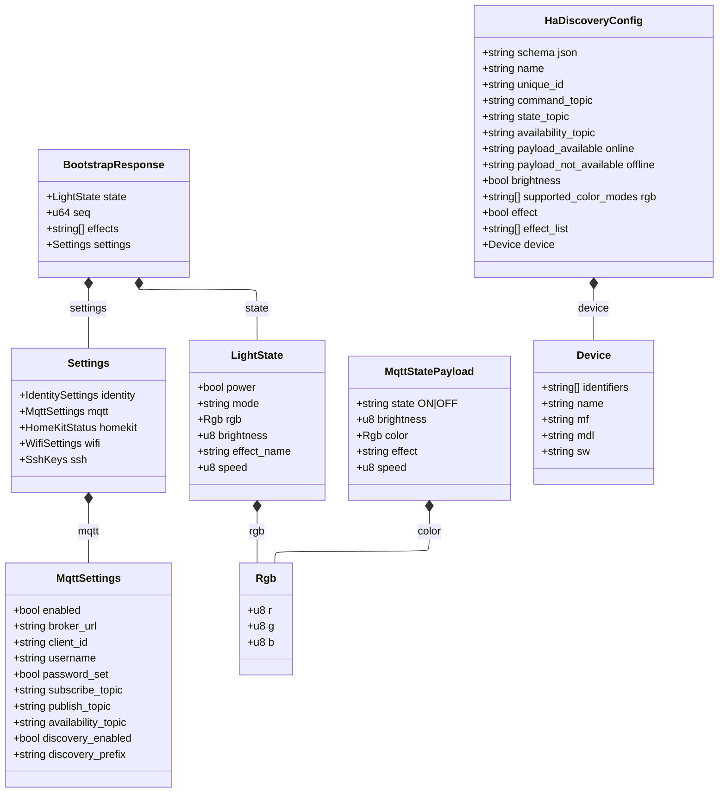
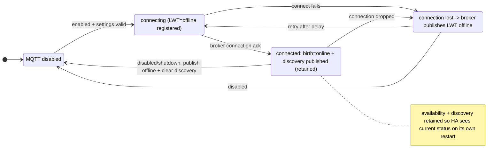

# Design: Preact SPA Frontend

<!-- spec-nav:start -->
**Spec navigation:** [State](00_state.md) · [Discovery](01_discovery.md) · [Requirements](02_requirements.md) · [Design](03_design.md) · [Tasks](04_tasks.md) · [Execution](05_execution.md)
<!-- spec-nav:end -->

Realizes the approved [`01_discovery.md`](01_discovery.md) chosen direction (Approach A) and the
approved criteria in [`02_requirements.md`](02_requirements.md) (R1–R18). The frontend becomes a
Preact + TypeScript SPA built by Vite into a committed [`web-dist/`](../../web-dist) directory embedded by
`rust-embed`; the axum layer gains a catch-all SPA fallback and an aggregate bootstrap endpoint;
the MQTT runtime gains Home Assistant availability + discovery.

## Current Technology Evidence

- **Vite — queried via Context7 (`/vitejs/vite`, v7).** `create-vite` provides a `preact-ts` template; `base`
  defaults to `/` (the UI is served at the site root, so no path rewriting); `vite build` writes
  `index.html` plus hashed files under an `assets/` subdirectory of `build.outDir`. Decision: a
  [`frontend/`](../../frontend) Vite project with `base: '/'`, `build.outDir: '../web-dist'`, `emptyOutDir: true`.
- **rumqttc — queried via Context7 (`/bytebeamio/rumqtt`, matching the pinned `0.24` in [`Cargo.toml`](../../Cargo.toml)).**
  `AsyncClient::publish(topic, QoS, retain: bool, payload)` — the `retain` flag is the third
  positional argument (already used in [`src/mqtt.rs`](../../src/mqtt.rs)); a Last-Will is set with
  `MqttOptions::set_last_will(LastWill::new(topic, payload, QoS, retain))`. Decision: register the
  availability Last-Will on `MqttOptions` before connecting, and publish availability + discovery
  with `retain = true`.
- **Home Assistant MQTT — queried via Context7 (`/websites/home-assistant_io_integrations`,
  `light.mqtt` + MQTT integration).** Availability is a birth message (`online`) plus a broker-published will
  (`offline`) on an availability topic; retained so HA has correct status on its own startup.
  Discovery is a retained JSON config at `<prefix>/<component>/<object_id>/config` (default prefix
  `homeassistant`) carrying `unique_id`, a `device` block, and command/state/availability topics;
  the JSON-schema light (`schema: "json"`) exchanges `{"state":"ON|OFF","brightness":0-255,
  "color":{"r","g","b"}}` and supports `effect`/`effect_list`. Publishing an empty retained payload
  to the config topic removes the entity. Decisions: use the JSON-schema light; make the MQTT
  command parser and state publisher HA-JSON-compatible; clear discovery when disabled.

## Dependency Security Evidence

No new **Rust/device** dependency is introduced: the shipped binary adds no crate, and MQTT
Last-Will/discovery reuses the already-vendored `rumqttc` `0.24` and `serde_json`, so no
device-artifact dependency-security gate applies here. The only additions are **frontend
build/runtime npm packages** — `preact` (shipped as prebuilt static assets, never executed on the
device) plus host-only build tooling (`vite`, `@preact/preset-vite`, TypeScript). A full
dependency-security audit of those is **not applicable at this design gate because** the
[`frontend/package-lock.json`](../../frontend/package-lock.json) that the audit resolves against does not exist until the frontend
project is scaffolded in execution; it is scheduled as an explicit execution task (run the `dependency-security-audit` skill against
the generated lockfile, `npm audit` in CI) before the bundle is committed. The intentional decision to add no
routing/state library keeps the frontend dependency surface to `preact` alone.

## Architecture

```mermaid
---
config:
  layout: elk
---
block
  columns 3
  block:browser["Browser SPA (Preact + TS)"]
    shell["App shell + client router"]
    dash["Dashboard: canvas preview, color, brightness, effect"]
    settings["Settings forms: identity/wifi/mqtt/homekit/ssh/device"]
    apiclient["typed api client (api.ts)"]
    wsclient["ws client (frame stream)"]
  end
  block:server["axum HTTP / WS"]
    spa["fallback: SPA + embedded assets"]
    rest["/api/* handlers"]
    boot["GET /api/bootstrap (aggregate)"]
    wsh["GET /ws handler"]
  end
  block:runtime["Device runtime"]
    engine["engine (state + frames)"]
    store[("settings store + persist")]
    mqtt["mqtt: availability LWT + HA discovery"]
    homekit["homekit"]
  end
  block:build["Host build"]
    vite["frontend/ vite build"]
    webdist[("web-dist/ (committed, rust-embed)")]
  end
  apiclient-- "JSON" -->rest
  apiclient-- "initial load" -->boot
  wsclient-- "frames" -->wsh
  spa-- "loads" -->shell
  rest-- "commands" -->engine
  boot-- "state+effects" -->engine
  boot-- "settings" -->store
  rest-- "settings" -->store
  wsh-- "subscribe" -->engine
  mqtt-- "set / publish state" -->engine
  mqtt-- "reads mqtt cfg" -->store
  vite-- "emits" -->webdist
  webdist-- "embedded" -->spa
```



The `/api/*` handlers, `/ws`, `engine`, `homekit`, `persist`, and the security guard are unchanged
except where called out below. The build path (Pi native `cargo build` from a source tarball) is
unchanged; only the embedded directory's origin (Vite output) changes.

## Components and Interfaces

### Backend — asset serving ([`src/web.rs`](../../src/web.rs))

`rust-embed` folder changes from [`web/`](../../web/) to the committed Vite output:

```rust
#[derive(RustEmbed)]
#[folder = "web-dist/"]
struct Assets;

/// Catch-all for everything not matched by an explicit /api or /ws route.
/// - a path beginning `api/` or equal to `ws` (an unknown API/WS path) -> 404 (AUDIT-2)
/// - exact embedded asset (e.g. `/assets/index-<hash>.js`, `/favicon.svg`) -> that asset
/// - a path with a file extension that is NOT embedded -> 404 (R12.4)
/// - any other path (client route, e.g. `/mqtt`) -> index.html (R12.2)
pub async fn serve_spa(uri: Uri) -> Response;
```

Hashed assets (`/assets/*`) are served with a long-lived immutable `Cache-Control`; `index.html`
is served with `no-cache` so a redeploy is picked up. The prior `serve_index`/`serve_asset` pair
and the explicit `/style.css`,`/app.js` routes are removed.

### Backend — router ([`src/api.rs`](../../src/api.rs))

`router()` drops the enumerated `get(serve_index)` routes (`/settings`, `/identity`, … and their
`/settings/*` aliases) and the two static-asset routes, adds `GET /api/bootstrap`, and terminates
with a fallback:

```rust
Router::new()
    .route("/healthz", get(healthz))
    .route("/api/state", get(get_state))
    .route("/api/effects", get(get_effects))
    // …existing /api/* light + settings routes, unchanged…
    .route("/api/bootstrap", get(get_bootstrap))   // new
    .route("/ws", get(crate::ws::ws_handler))
    .fallback(crate::web::serve_spa)                // replaces enumerated serve_index routes
    .with_state(state)
```

Because axum runs `fallback` only when no route matches, `/api/*` and `/ws` keep routing to their
handlers (R12.3). Existing `/api/power` and `/api/settings/homekit/pairing-code` are **kept** (API
completeness); no `/api/*` handler is pruned. The only pruning is the enumerated SPA routes.

### Backend — bootstrap aggregate ([`src/api.rs`](../../src/api.rs))

```rust
#[derive(Serialize)]
struct BootstrapResponse {
    state: State,
    seq: u64,
    effects: Vec<&'static str>,
    settings: BootstrapSettings,
}
#[derive(Serialize)]
struct BootstrapSettings {
    identity: IdentitySettings,
    mqtt: MqttSettingsResponse,       // password-hidden, same as GET /api/settings/mqtt
    homekit: HomeKitSettingsResponse, // same as GET /api/settings/homekit
    wifi: WifiSettings,
    ssh_keys: String,
}

async fn get_bootstrap(headers, State(st)) -> Result<Json<BootstrapResponse>, StatusCode>;
```

`get_bootstrap` runs the same `check(&headers, &st.security)` guard and composes the values from
the same sources the individual endpoints use (engine snapshot, `effect_names()`, settings store,
`read_wifi_settings`, `read_authorized_keys`), so each field equals its per-endpoint value
(R11.2). It is gated because it exposes settings (MQTT username, SSH keys) exactly as the existing
endpoints do.

### Backend — MQTT availability + discovery ([`src/mqtt.rs`](../../src/mqtt.rs), [`src/settings.rs`](../../src/settings.rs))

`MqttSettings` gains three fields with serde defaults (so existing `settings.json` still loads):

```rust
pub availability_topic: String,   // default "moodlightpi/availability"
pub discovery_enabled: bool,      // default true
pub discovery_prefix: String,     // default "homeassistant"
```

New/changed functions in `mqtt.rs`:

```rust
// Registered on MqttOptions BEFORE connect, so the broker publishes it on unexpected drop (R17.1).
fn availability_will(s: &MqttSettings) -> Option<LastWill>;              // "offline", retain=true
async fn publish_availability(c: &AsyncClient, s: &MqttSettings, online: bool); // retain=true (R17.2/R17.3)
fn discovery_topic(s: &MqttSettings) -> String;                          // "<prefix>/light/<object_id>/config"
fn build_discovery_config(s: &MqttSettings, id: &IdentitySettings, effects: &[&str]) -> serde_json::Value;
async fn publish_discovery(c: &AsyncClient, s: &MqttSettings, id: &IdentitySettings); // retain=true (R18.1)
async fn clear_discovery(c: &AsyncClient, s: &MqttSettings);             // empty retained payload (R18.4)
```

`run_connection` sets the will on `MqttOptions`, then after subscribe publishes `online` and (when
`discovery_enabled`) the discovery config. Every exit path from `run_connection` — settings
changed to disabled, shutdown, or the enabled→disabled transition observed by `run` — performs a
best-effort `publish_availability(false)` and, if discovery had been published, `clear_discovery`
before returning (R17.4, R18.4). `publish_state` and `commands_from_payload` are extended to speak
the HA JSON-schema light dialect (see Data Models); the existing extra fields are retained so the
device's own MQTT consumers keep working.

`discovery_topic` derives `object_id` by sanitizing `client_id` to `[a-z0-9_-]`; `unique_id` is the
same `client_id`, giving HA a stable identity across reconnects (R18.2).

### Backend — MQTT settings API ([`src/api.rs`](../../src/api.rs))

`MqttSettingsResponse` and `MqttSettingsSave` gain `availability_topic`, `discovery_enabled`, and
`discovery_prefix` (R6.5/R6.6). `validate_mqtt_settings` additionally requires a non-empty
`availability_topic` and, when `discovery_enabled`, a non-empty `discovery_prefix` (R6.4).

### Frontend — module layout ([`frontend/`](../../frontend))

| Path | Responsibility |
|---|---|
| `index.html`, `vite.config.ts`, `tsconfig.json`, `package.json` | Vite `preact-ts` project; `base:'/'`, `outDir:'../web-dist'`, `emptyOutDir:true` |
| `src/main.tsx` | mount `<App/>` |
| `src/types.ts` | TS types mirroring the API (LightState, BootstrapResponse, MqttSettings, …) |
| `src/api.ts` | typed, same-origin fetch client (below) |
| `src/ws.ts` | LED-frame WebSocket with 1 s reconnect |
| `src/router.ts` | hand-rolled `useRoute()` + `navigate()` over the History API |
| `src/store.tsx` | context: device state, effect list, toast queue |
| `src/components/*` | `Header`, `StatusPill`, `Dashboard` (`Preview`, `ColorPanel`, `BrightnessPanel`, `EffectPanel`), `SettingsLayout`, `IdentityForm`, `WifiForm`, `MqttForm`, `HomeKitForm`, `SshForm`, `DevicePanel`, `SystemDialog`, `Toast` |

Key signatures:

```ts
// api.ts — every call is same-origin (relative URL); non-2xx throws Error(payload.error ?? status) (R14.1, R16.2)
export async function getBootstrap(): Promise<BootstrapResponse>;
export async function getState(): Promise<{ state: LightState; seq: number }>;
export async function setColor(rgb: Rgb): Promise<void>;
export async function setBrightness(value: number /*0-255*/): Promise<void>;
export async function setEffect(name: string, speed?: number): Promise<void>;
export async function setPower(on: boolean): Promise<void>;
export async function systemAction(action: 'restart_service'|'reboot'|'poweroff'): Promise<{queued:boolean}>;
export async function getMqtt(): Promise<MqttSettings>;
export async function saveMqtt(body: MqttSave): Promise<MqttSettings>;
export async function scanWifi(): Promise<{ networks: string[] }>;
// …identity/wifi/homekit/ssh getters + setters…

// ws.ts
export function connectFrames(onFrame: (pixels: [number,number,number][]) => void): () => void;

// router.ts
export function useRoute(): { path: string };
export function navigate(path: string): void;
```

`Preview` renders the 32 pixels onto an 8×4 `<canvas>`, reversed in x and y to match the panel
(R2.1/R2.2); brightness maps 0–255↔0–100 % and speed/brightness sends are debounced 80 ms
(R1.2/R1.5); `EffectPanel` hides the speed control while the effect is `solid` (R1.4) and fills its
options from `effects` in the bootstrap/`/api/effects` (R1.6). `SystemDialog` maps its three buttons
to `systemAction` and closes on cancel/Escape without sending (R9.1/R9.3).

### Build pipeline + stale-bundle guard

- Host: `cd frontend && npm ci && npm run build` writes [`web-dist/`](../../web-dist). [`web-dist/`](../../web-dist) is committed.
- [`deploy/check-bundle.sh`](../../deploy/check-bundle.sh) rebuilds into a temp dir and compares against committed [`web-dist/`](../../web-dist)
  (byte-identical), exiting non-zero on drift (R13.3). It runs in CI and is invoked by
  [`deploy/build.sh`](../../deploy/build.sh) on the host before the source tarball is sent to the
  Pi, so a stale bundle blocks deployment. The Pi build itself is unchanged and needs no Node
  (R13.1) — it embeds the committed [`web-dist/`](../../web-dist) via `rust-embed` (R13.2).

## Data Models



`MqttStatePayload` is published to `publish_topic`. It adds HA's `state` (`ON`/`OFF`) and uses
`color` as the `{r,g,b}` **object** HA's JSON-schema light expects. **`color` key resolution
(AUDIT-1):** today's payload emits `color` as a hex string ([`src/mqtt.rs`](../../src/mqtt.rs) line 132); since a single
`color` key cannot be both, the hex string is dropped and the already-present `rgb` object remains
the device-native color field, while `color` becomes the HA object. `commands_from_payload` accepts
the HA fields — `state`→power and `color` **object**→rgb — in addition to today's `power`/`rgb` and
the legacy hex `color` string (still parsed when `color` is a string, for backward compatibility).
`HaDiscoveryConfig` is the retained payload at `discovery_topic`. TypeScript mirrors of
`BootstrapResponse`/`LightState`/`MqttSettings` live in `src/types.ts`.

## Key Flows

- **Initial load (R11.3, R3, R2):** the SPA calls `getBootstrap()` once, seeds the store (state,
  effects, all settings), renders the requested route, then opens the frame WebSocket. Health
  (15 s) and state (≥ every 5 s, R3.3) polling start after first paint.
- **Control (R1):** each control calls the matching `api.ts` function; brightness/speed are
  debounced 80 ms; on success the store re-reads state so the UI reflects the device.
- **MQTT availability + discovery lifecycle (R17, R18):**



(The MQTT lifecycle diagram intentionally omits the ELK layout config — `stateDiagram-v2` does not
support ELK.)

## Error Handling

- Each `api.ts` call rejects on non-2xx with the server's `error` message; forms catch and raise a
  failure toast (R16.2) and preserve entered values (e.g. Wi-Fi SSID on scan failure, R5.4).
- Server rejects: empty identity name/label → 400 (R4.3); invalid MQTT → 400 (R6.4); empty HomeKit
  accessory name → 400 (R7.4); invalid SSH keys → 400 (R8.4); unknown system action → 400 (R9.2).
  These reuse the existing `json_error` handlers.
- Asset fallback: a missing file-like path returns 404, never `index.html` (R12.4).
- WebSocket close → reconnect within ~1 s (R2.3); health failure → offline indicator (R3.2).

## Cross-Cutting Risk Gates

- **Security / authorization:** the SPA uses only same-origin relative URLs (R14.1); `/api/*`,
  `/api/bootstrap`, and `/ws` keep the Host/Origin guard (R14.2). *Failure mode:* a fallback that
  shadowed `/api` or served settings without the guard. *Verification:* API tests for foreign-Origin
  403 on `/api/bootstrap`, and that `/api/*`/`/ws` still route under the fallback. *Owner:* backend.
- **Privacy:** bootstrap exposes MQTT username + SSH keys, identical to existing endpoints and
  guarded identically; MQTT password stays write-only (`password_set` only). No new exposure.
- **Accessibility:** forms keep labels/`for` associations; dialog is focus-trapped and
  Escape-closable (R9.3); status conveyed by text, not color alone. *Verification:* manual + a11y
  smoke check.
- **Performance / footprint:** bundle JS+CSS ≤ 50 KB gz (R15.1), verified by a size check on
  [`web-dist/`](../../web-dist); bootstrap collapses 8 initial requests to 1 (R11) — material on the Pi Zero W.
- **Observability:** MQTT availability/discovery publishes and failures are `tracing`-logged, as
  existing MQTT code is.
- **Migration:** `settings.json` stays compatible via serde defaults on the three new MQTT fields;
  first save populates them. No data migration.
- **Rollout:** ship via the existing tarball build; the stale-bundle guard blocks deploying an
  out-of-date UI (R13.3).
- **Rollback:** revert the commit (binary re-embeds the previous [`web-dist/`](../../web-dist)); MQTT clears its
  retained discovery on downgrade only if reached via a clean disable — noted as an accepted minor
  limitation (a stale retained discovery topic can be cleared manually).

## Requirement Coverage

| Requirement | Realized by |
|---|---|
| R1 light control | `Dashboard` panels + `api.ts` (`setColor/Brightness/Effect`), debounce, `solid` hides speed, effects from bootstrap |
| R2 preview | `ws.ts` + `Preview` canvas, reversed orientation, 1 s reconnect |
| R3 status | `StatusPill` + health poll; state poll ≥5 s |
| R4–R8 settings | `IdentityForm`/`WifiForm`/`MqttForm`/`HomeKitForm`/`SshForm` + existing `/api/settings/*` (+ MqttSettings new fields) |
| R9 system | `SystemDialog` + `/api/system/action` |
| R10 routing | `router.ts` + fallback serving `index.html` for client routes |
| R11 bootstrap | `get_bootstrap` + `getBootstrap()` single initial load |
| R12 serving | `serve_spa` fallback + `rust-embed` |
| R13 build | committed [`web-dist/`](../../web-dist), `rust-embed`, `check-bundle.sh` |
| R14 security | same-origin `api.ts`, retained Host/Origin guard |
| R15 footprint | preact-only deps + size check |
| R16 feedback | `Toast` on success/failure |
| R17 availability | `availability_will` + `publish_availability` (retained) + exit-path offline |
| R18 discovery | `build_discovery_config`/`publish_discovery`/`clear_discovery` |

## Correctness Properties

1. **Light commands round-trip.** Setting color, brightness (0–255, shown as 0–100 %), or effect
   sends the corresponding request and the displayed state converges to the device state; the
   effect list is exactly what the server advertises. **Validates: Requirements 1.1, 1.2, 1.3, 1.6**
2. **Speed control gating + debounce.** The speed control is present iff the selected effect is not
   `solid`; continuous brightness/speed movement emits ≤1 request per 80 ms idle.
   **Validates: Requirements 1.4, 1.5**
3. **Preview fidelity.** While the dashboard is open, each WS frame paints all 32 pixels in an 8×4
   grid reversed on both axes; a closed socket reconnects within ~1 s.
   **Validates: Requirements 2.1, 2.2, 2.3**
4. **Reachability.** Successful health → active indicator; failed health → offline indicator; light
   state refreshes at least every 5 s. **Validates: Requirements 3.1, 3.2, 3.3**
5. **Settings display + persist (happy path).** Opening each settings section shows current values
   (password never revealed; pairing code only while enabled+ready+unpaired), and a valid save
   sends the fields and reflects the saved result. **Validates: Requirements 4.1, 4.2, 5.1, 5.2, 5.3, 6.1, 6.2, 6.3, 6.5, 6.6, 7.1, 7.2, 7.3, 8.1, 8.2, 8.3**
6. **Settings rejection (unhappy path).** Empty identity name/label, invalid MQTT, empty HomeKit
   accessory name, invalid SSH keys, and an unavailable Wi-Fi scan each yield a server error the UI
   surfaces without losing entered input. **Validates: Requirements 4.3, 5.4, 6.4, 7.4, 8.4**
7. **System actions.** Confirming restart-service/reboot/poweroff requests that action and confirms
   queued; an unknown action is rejected; cancel/Escape sends nothing.
   **Validates: Requirements 9.1, 9.2, 9.3**
8. **Client navigation.** Each section has a distinct path; direct load/refresh of any client path
   serves the SPA which renders that view; back/forward shows the corresponding view.
   **Validates: Requirements 10.1, 10.2, 10.3**
9. **Bootstrap equivalence.** `GET /api/bootstrap` returns state, effects, and all settings in one
   response whose field values equal the individual endpoints', and the SPA's first load uses only
   it. **Validates: Requirements 11.1, 11.2, 11.3**
10. **Asset/fallback routing.** Embedded asset paths serve their bytes + content type; non-asset,
    non-API, non-WS paths serve `index.html`; `/api/*` and `/ws` are never shadowed; a missing
    file-like path is 404. **Validates: Requirements 12.1, 12.2, 12.3, 12.4**
11. **Self-contained build.** A Rust-only build (no Node) yields a binary serving the whole UI from
    memory; a committed bundle inconsistent with [`frontend/`](../../frontend) source fails the guard.
    **Validates: Requirements 13.1, 13.2, 13.3**
12. **Security parity.** All SPA requests are same-origin; a foreign Host/Origin on any `/api` or
    `/ws` request (including bootstrap) is rejected 403. **Validates: Requirements 14.1, 14.2**
13. **Footprint.** The compressed JS+CSS of [`web-dist/`](../../web-dist) is ≤ 50 KB. **Validates: Requirements 15.1**
14. **Feedback.** A successful save/action shows a transient confirmation; a failed request shows a
    transient error. **Validates: Requirements 16.1, 16.2**
15. **MQTT availability.** On connect the broker holds a retained `offline` will and the device
    publishes retained `online`; on clean disable/shutdown it publishes `offline` first; a
    subscriber connecting later immediately sees current availability.
    **Validates: Requirements 17.1, 17.2, 17.3, 17.4**
16. **HA discovery.** While MQTT+discovery are enabled, a retained JSON-schema light config is
    published under the prefix with stable `unique_id`, a `device` block, command/state/availability
    topics, and on/off+color+brightness capability; disabling clears it.
    **Validates: Requirements 18.1, 18.2, 18.3, 18.4**

## Testing Strategy

- **Rust unit/integration:** update the `rust-embed` test to assert `index.html` and an
  `assets/`-prefixed file embed; add `serve_spa` tests (client route→index, missing asset→404,
  `/api/*` and `/ws` unshadowed); `get_bootstrap` equivalence + foreign-Origin 403; MQTT tests for
  `build_discovery_config`, `discovery_topic`, availability payloads, and `commands_from_payload`
  accepting the HA JSON schema.
- **Frontend unit (Vitest):** pure helpers — brightness↔percent, hex↔rgb, WS frame parsing, and the
  `api.ts` error path.
- **Guard/size:** `check-bundle.sh` in CI; a bundle-size assertion against the 50 KB budget.
- **Live:** exercise every section against `moodlightpi.local`; verify HA shows the light via
  discovery and flips available/unavailable on service stop.

## Rejected Alternatives

Per [`01_discovery.md`](01_discovery.md): a gitignored build directory built only in deploy (breaks bare
`cargo build`/CI) and a no-build vendored-ESM frontend (conflicts with the chosen Vite+TS and
type-safety goal) were rejected. This design does not reopen that decision. Additional local
choices: **hand-rolled router + hooks** over a routing/state library (footprint + supply-chain
minimization) and **keeping** rather than pruning `/api/power` and the HomeKit pairing-code
endpoint (API completeness, negligible cost).

## Open Decisions (resolved)

- **Bundle location:** a new committed [`web-dist/`](../../web-dist) (clearly generated), replacing [`web/`](../../web/); the three
  legacy files are deleted. `rust-embed` folder becomes [`web-dist/`](../../web-dist).
- **Bootstrap shape:** aggregates state+seq+effects+all settings; individual endpoints are kept.
- **Unused routes:** `/api/power` and `/api/settings/homekit/pairing-code` are kept; only the
  enumerated SPA routes are removed.
- **Dev proxy:** deferred (not required for parity); the SPA can be exercised directly against a
  running device.

## Approval

Status: **Approved on 2026-08-16** (audit fixes AUDIT-1/AUDIT-2 applied and re-approved 2026-08-16)
