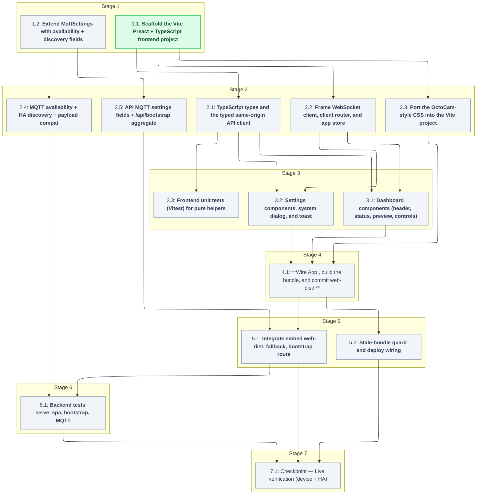

# Tasks: Preact SPA Frontend

<!-- spec-nav:start -->
**Spec navigation:** [State](00_state.md) · [Discovery](01_discovery.md) · [Requirements](02_requirements.md) · [Design](03_design.md) · [Tasks](04_tasks.md) · [Execution](05_execution.md)
<!-- spec-nav:end -->

## Stage and Dependency Overview

Implementation plan for [`03_design.md`](03_design.md), tracing to [`02_requirements.md`](02_requirements.md)
(R1–R18). Two mostly-independent tracks — the **frontend** ([`frontend/`](../../frontend) → committed [`web-dist/`](../../web-dist)) and
the **backend** ([`src/`](../../src/) MQTT + API) — converge at the integration task (5.1) and the
live-verification checkpoint (7.1). `spec-execute` checks the boxes as it verifies; leave them unchecked.

## Delivery Schedule

| Stage | Task | Estimate | Depends on | Critical path |
|---|---|---|---|---|
| 1 | 1.1 Frontend scaffold | 1–2 hours | — | yes |
| 1 | 1.2 MqttSettings extension | 0.5–1 hours | — | no |
| 2 | 2.1 Types + API client | 2–3 hours | 1.1 | yes |
| 2 | 2.2 WS + router + store | 1.5–2.5 hours | 1.1 | no |
| 2 | 2.3 CSS port (OctoCam layout) | 2–4 hours | 1.1 | no |
| 2 | 2.4 MQTT availability + discovery | 3–5 hours | 1.2 | no |
| 2 | 2.5 API MQTT fields + bootstrap | 2–3 hours | 1.2 | no |
| 3 | 3.1 Dashboard components | 3–4 hours | 2.1, 2.2 | yes |
| 3 | 3.2 Settings components | 4–6 hours | 2.1, 2.2 | no |
| 3 | 3.3 Frontend unit tests | 1–2 hours | 2.1 | no |
| 4 | 4.1 App wiring + build → web-dist | 1.5–2.5 hours | 2.3, 3.1, 3.2 | yes |
| 5 | 5.1 Integration: embed + fallback + routes | 2–3 hours | 4.1, 2.5 | yes |
| 5 | 5.2 Stale-bundle guard + deploy wiring | 1.5–2.5 hours | 4.1 | no |
| 6 | 6.1 Backend tests (serve_spa, bootstrap, MQTT) | 2–3 hours | 2.4, 5.1 | yes |
| 7 | 7.1 Live verification (device + HA) | 1–2 hours | 5.1, 5.2, 6.1 | yes |

No confirmed calendar dates exist, so this is duration-only planning (no Gantt).

## Tasks

### Stage 1

- [x] 1.1 **Scaffold the Vite Preact + TypeScript frontend project**
  - Create a `preact-ts` Vite project under [`frontend/`](../../frontend): `package.json` (dep `preact`; dev
    `vite`, `@preact/preset-vite`, `typescript`, `vitest`), `package-lock.json`, `tsconfig.json`,
    `vite.config.ts`, `index.html`, `src/main.tsx` rendering a placeholder `<App/>`. Add the
    frontend ignore entries (the frontend `node_modules`, keep [`web-dist/`](../../web-dist) tracked).
  - `vite.config.ts`: `base: '/'`, `build.outDir: '../web-dist'`, `build.emptyOutDir: true`,
    `@preact/preset-vite`. Confirm against the design's Current Technology Evidence
    (Context7 `/vitejs/vite`); re-query if the pinned Vite major has changed.
  - **Files:** [`frontend/package.json`](../../frontend/package.json), [`frontend/package-lock.json`](../../frontend/package-lock.json), [`frontend/tsconfig.json`](../../frontend/tsconfig.json), [`frontend/vite.config.ts`](../../frontend/vite.config.ts), [`frontend/index.html`](../../frontend/index.html), [`frontend/src/main.tsx`](../../frontend/src/main.tsx), [`.gitignore`](../../.gitignore)
  - **Interfaces:** Consumes: design §"Frontend — module layout", Current Technology Evidence (Vite `base:'/'`, `outDir:'../web-dist'`, `emptyOutDir:true`); Produces: a buildable Vite project whose `npm run build` emits [`web-dist/index.html`](../../web-dist/index.html) + `web-dist/assets/*`, and a resolved [`frontend/package-lock.json`](../../frontend/package-lock.json).
  - **Documentation:** header comment in `vite.config.ts` stating the embed contract (why `outDir` is the repo-level [`web-dist/`](../../web-dist) and why `emptyOutDir`); no other public surface.
  - **Dependency resolution:** change
  - **Dependency delivery:** none
  - **Context7 evidence:** state=completed | identity=/vitejs/vite | version=7.3.6 | decision=preact-ts scaffold with base '/' and outDir '../web-dist'; base default '/' and dist/assets layout confirmed
  - **Pre-change dependency audit:** state=completed | command=dependency-security-audit change | mode=change | timestamp=2026-08-16T18:39:06.707861Z | project_revision=34f666ffc8a2294da5aecbefcc1779e6cf29eab5 | inventory_fingerprint=8c7c6ec061c7c79294ca928b41cae01171b7cd6d0bd02556fdf1ca54014da338 | json=[pre-change.json](../../.security/dependency-audit/pre-change.json) | markdown=[pre-change.md](../../.security/dependency-audit/pre-change.md) | review=completed | result=warnings | exit=0 | decision=empty-baseline snapshot before adding frontend deps; 0 findings | warnings_reviewed=true | clean=false
  - **Resolution edit:** state=completed | files=[frontend/package.json](../../frontend/package.json), [frontend/package-lock.json](../../frontend/package-lock.json)
  - **Project tests:** state=completed | evidence=[frontend-build-test.md](../../.specs/preact-frontend/evidence/frontend-build-test.md)
  - **Post-change dependency audit:** state=completed | command=dependency-security-audit change | mode=change | timestamp=2026-08-16T18:39:09.313934Z | project_revision=34f666ffc8a2294da5aecbefcc1779e6cf29eab5 | inventory_fingerprint=814a1ddf64553b2b21ede85ae3cc2f815928f740080f057c189c62077728726d | json=[post-change.json](../../.security/dependency-audit/post-change.json) | markdown=[post-change.md](../../.security/dependency-audit/post-change.md) | review=completed | result=warnings | exit=0 | decision=frontend deps (preact + vite toolchain) audited, 0 vulnerability findings; warnings are inventory-completeness only, accepted | warnings_reviewed=true | clean=false
  - **Stage:** 1
  - **Verification:** `cd frontend && npm ci && npm run build` produces [`web-dist/index.html`](../../web-dist/index.html) and hashed `web-dist/assets/*`; the ignore file excludes the frontend `node_modules` but not [`web-dist/`](../../web-dist); `npm audit` clean of high/critical (post-change record above); config comment reviewed.
  - **Estimated effort:** 1–2 hours
  - **Risk:** low — adds the npm dependency surface; supply chain covered by the pre/post-change dependency-audit records above. Rollback: remove [`frontend/`](../../frontend) and [`web-dist/`](../../web-dist).
  - **Task category:** code_analysis
  - **Delegation:** controller
  - _Requirements: 13.1, 15.1_

- [ ] 1.2 **Extend `MqttSettings` with availability + discovery fields**
  - In [`src/settings.rs`](../../src/settings.rs) add `availability_topic: String` (default
    `moodlightpi/availability`), `discovery_enabled: bool` (default `true`), `discovery_prefix:
    String` (default `homeassistant`), each with a serde default so existing `settings.json`
    still deserializes. Update `validate_mqtt_settings` to require a non-empty `availability_topic`
    and, when `discovery_enabled`, a non-empty `discovery_prefix`.
  - **Files:** [`src/settings.rs`](../../src/settings.rs)
  - **Interfaces:** Consumes: design "Backend — MQTT availability + discovery" data model; Produces: `MqttSettings` with the three new fields + defaults, and an extended `validate_mqtt_settings(&MqttSettings) -> Result<(), _>`.
  - **Documentation:** doc comments on the three new fields stating default + purpose (HA availability/discovery); rationale for serde defaults (backward compatibility).
  - **Dependency resolution:** none
  - **Dependency delivery:** none
  - **Stage:** 1
  - **Verification:** `cargo test` passes; a unit test confirms an old-format `settings.json` (without the new keys) still loads with defaults; validation rejects empty availability topic / empty prefix when discovery enabled; doc comments reviewed.
  - **Estimated effort:** 0.5–1 hours
  - **Risk:** low. Rollback: revert the struct fields.
  - **Task category:** code_analysis
  - **Delegation:** sequential subagent
  - _Requirements: 6.5, 6.6, 6.4_

### Stage 2

- [ ] 2.1 **TypeScript types and the typed same-origin API client**
  - Add `frontend/src/types.ts` (mirror `LightState`, `Rgb`, `BootstrapResponse`, `MqttSettings`
    + `MqttSave`, identity/wifi/homekit/ssh shapes from design Data Models) and
    `frontend/src/api.ts` with the functions in design §"Frontend — module layout" (`getBootstrap`,
    `getState`, `setColor`, `setBrightness`, `setEffect`, `setPower`, `systemAction`, settings
    getters/setters, `scanWifi`). Every call uses a relative (same-origin) URL and throws
    `Error(payload.error ?? status)` on non-2xx.
  - **Files:** `frontend/src/types.ts`, `frontend/src/api.ts`
  - **Depends on:** 1.1
  - **Interfaces:** Consumes: 1.1 project; design endpoint contracts (`/api/*`, `/api/bootstrap`, request/response JSON shapes); Produces: exported types + the `api.ts` async functions with the exact signatures in the design.
  - **Documentation:** TSDoc on each exported function (method+path, when it throws); `types.ts` notes each type mirrors a specific server contract.
  - **Dependency resolution:** none
  - **Dependency delivery:** none
  - **Stage:** 2
  - **Verification:** `tsc --noEmit` clean; error path returns server `error` message (covered by 3.3); TSDoc reviewed.
  - **Estimated effort:** 2–3 hours
  - **Risk:** low.
  - **Task category:** code_analysis
  - **Delegation:** parallel-safe
  - _Requirements: 11.1, 11.3, 14.1, 16.2_

- [ ] 2.2 **Frame WebSocket client, client router, and app store**
  - `frontend/src/ws.ts` (`connectFrames(onFrame)`, same-origin `ws(s)://…/ws`, reconnect within
    ~1 s), `frontend/src/router.ts` (`useRoute()` + `navigate()` over History API + `popstate`),
    `frontend/src/store.tsx` (context holding device state, effect list, toast queue).
  - **Files:** `frontend/src/ws.ts`, `frontend/src/router.ts`, `frontend/src/store.tsx`
  - **Depends on:** 1.1
  - **Interfaces:** Consumes: 1.1 project; design signatures for `connectFrames`, `useRoute`, `navigate`; Produces: those exports plus a `useStore()` hook exposing state + `pushToast`.
  - **Documentation:** TSDoc on `connectFrames` (reconnect contract), `navigate`/`useRoute` (path model), and the store context (what it owns).
  - **Dependency resolution:** none
  - **Dependency delivery:** none
  - **Stage:** 2
  - **Verification:** `tsc --noEmit` clean; frame-parse unit covered by 3.3; reconnect logic reviewed; TSDoc reviewed.
  - **Estimated effort:** 1.5–2.5 hours
  - **Risk:** low.
  - **Task category:** code_analysis
  - **Delegation:** parallel-safe
  - _Requirements: 2.1, 2.3, 3.3, 10.1, 10.3, 16.1_

- [ ] 2.3 **Port the OctoCam-style CSS into the Vite project**
  - Recreate the existing UI's look ([`web/style.css`](../../web/style.css)) as
    `frontend/src/styles.css`: `:root` design tokens (dark theme), dashboard grid + settings
    sidebar/workspace layout, custom range sliders, color input, toggle switches, status pills,
    cards, modal dialog, toast; responsive media queries. Imported once from `main.tsx`.
  - **Files:** `frontend/src/styles.css`
  - **Depends on:** 1.1
  - **Interfaces:** Consumes: [`web/style.css`](../../web/style.css) as the visual reference (OctoCam layout, parity); Produces: `styles.css` with the class names the components in 3.1/3.2 will use.
  - **Documentation:** top-of-file comment noting the token system and that it preserves the prior OctoCam layout; `no public surface` otherwise.
  - **Dependency resolution:** none
  - **Dependency delivery:** none
  - **Stage:** 2
  - **Verification:** builds; visual parity confirmed in 7.1; contributes to the ≤50 KB budget checked in 4.1/5.2.
  - **Estimated effort:** 2–4 hours
  - **Risk:** low.
  - **Task category:** code_analysis
  - **Delegation:** parallel-safe
  - _Requirements: 15.1_

- [ ] 2.4 **MQTT availability + HA discovery + payload compat**
  - In [`src/mqtt.rs`](../../src/mqtt.rs): register `LastWill::new(availability_topic, "offline",
    QoS::AtLeastOnce, retain=true)` on `MqttOptions` before connect; after subscribe publish
    retained `online`; when `discovery_enabled` publish the retained discovery config at
    `<prefix>/light/<object_id>/config` (`build_discovery_config`, `discovery_topic`, JSON-schema
    light with `unique_id` = sanitized `client_id`, `device` block, command/state/availability
    topics, `brightness`, `supported_color_modes:["rgb"]`, `effect`+`effect_list`). On every exit
    path (settings→disabled, shutdown, enabled→disabled) publish `offline` and `clear_discovery`
    (empty retained payload). Extend `publish_state` to add `state:"ON"/"OFF"` + `color:{r,g,b}` and
    `commands_from_payload` to accept HA's `state`/`color`. **AUDIT-1 color-key resolution:** publish
    `color` as the `{r,g,b}` object HA expects, drop the legacy hex-string `color` (keep the existing
    `rgb` object as the device-native field), and make `commands_from_payload` accept `color` as an
    object (HA) while still parsing a hex `color` string for backward compatibility. Confirm the
    rumqttc `LastWill`/`publish` signatures against the design's Current Technology Evidence
    (Context7 `/bytebeamio/rumqtt`).
  - **Files:** [`src/mqtt.rs`](../../src/mqtt.rs)
  - **Depends on:** 1.2
  - **Interfaces:** Consumes: `MqttSettings` new fields (1.2); `IdentitySettings`; `effect_names()`; rumqttc `MqttOptions::set_last_will`, `AsyncClient::publish(topic, QoS, retain, payload)`; Produces: `availability_will`, `publish_availability`, `discovery_topic`, `build_discovery_config`, `publish_discovery`, `clear_discovery`, and HA-compatible `publish_state`/`commands_from_payload`.
  - **Documentation:** doc comments on each new fn stating its MQTT/HA contract (retain semantics, when called) and the payload-compat rationale on `publish_state`/`commands_from_payload`.
  - **Dependency resolution:** none
  - **Dependency delivery:** none
  - **Stage:** 2
  - **Verification:** unit tests (added in 6.1) for `build_discovery_config`, availability payload/retain, and `commands_from_payload` accepting `{"state":"ON","color":{...}}`; existing MQTT tests still pass; doc comments reviewed.
  - **Estimated effort:** 3–5 hours
  - **Risk:** medium — behavior change to a live integration. Rollback: revert `mqtt.rs`; a stale retained discovery/availability topic may need manual clearing.
  - **Task category:** heavy_reasoning
  - **Delegation:** sequential subagent
  - _Requirements: 17.1, 17.2, 17.3, 17.4, 18.1, 18.2, 18.3, 18.4_

- [ ] 2.5 **API: MQTT settings fields + `/api/bootstrap` aggregate**
  - In [`src/api.rs`](../../src/api.rs): add `availability_topic`, `discovery_enabled`,
    `discovery_prefix` to `MqttSettingsResponse` and `MqttSettingsSave`; add `BootstrapResponse` +
    `BootstrapSettings` and `get_bootstrap` (runs `check()`, composes engine snapshot,
    `effect_names()`, identity, `MqttSettingsResponse`, `HomeKitSettingsResponse`,
    `read_wifi_settings`, `read_authorized_keys`). Does not yet register the route (5.1 owns the
    router).
  - **Files:** [`src/api.rs`](../../src/api.rs)
  - **Depends on:** 1.2
  - **Interfaces:** Consumes: `MqttSettings` (1.2); existing settings readers + `AppState`; Produces: extended MQTT request/response structs and `async fn get_bootstrap(...) -> Result<Json<BootstrapResponse>, StatusCode>` whose fields equal the individual endpoints'.
  - **Documentation:** doc comments on `BootstrapResponse`/`get_bootstrap` (single-round-trip contract, why it's Host/Origin-gated) and on the new MQTT fields.
  - **Dependency resolution:** none
  - **Dependency delivery:** none
  - **Stage:** 2
  - **Verification:** `get_bootstrap` field-equivalence + foreign-Origin 403 tests (in 6.1); MQTT save/response round-trip includes the new fields with password still hidden; doc comments reviewed.
  - **Estimated effort:** 2–3 hours
  - **Risk:** low.
  - **Task category:** code_analysis
  - **Delegation:** sequential subagent
  - _Requirements: 11.1, 11.2, 6.1, 6.5, 6.6, 14.2_

### Stage 3

- [ ] 3.1 **Dashboard components (header, status, preview, controls)**
  - `Header.tsx`, `StatusPill.tsx` (health-poll active/offline), `Dashboard.tsx`, `Preview.tsx`
    (8×4 canvas, 32 pixels reversed in x and y, fed by `connectFrames`), `ColorPanel.tsx` (color
    input + 5 preset swatches), `BrightnessPanel.tsx` (0–100 %↔0–255, 80 ms debounce),
    `EffectPanel.tsx` (options from effect list, speed slider hidden when `solid`, 80 ms debounce).
  - **Files:** `frontend/src/components/Header.tsx`, `frontend/src/components/StatusPill.tsx`, `frontend/src/components/Dashboard.tsx`, `frontend/src/components/Preview.tsx`, `frontend/src/components/ColorPanel.tsx`, `frontend/src/components/BrightnessPanel.tsx`, `frontend/src/components/EffectPanel.tsx`
  - **Depends on:** 2.1, 2.2
  - **Interfaces:** Consumes: `api.ts` setters + `getState` (2.1), `connectFrames`/`useStore`/`useRoute` (2.2), `styles.css` class names (2.3); Produces: the dashboard component tree mounted by 4.1.
  - **Documentation:** TSDoc on each component (props + the requirement behavior it implements, e.g. reversed-axis rendering, debounce, solid-hides-speed).
  - **Dependency resolution:** none
  - **Dependency delivery:** none
  - **Stage:** 3
  - **Verification:** `tsc --noEmit` clean; behaviors confirmed live in 7.1 (color/brightness/effect round-trip, preview, status); TSDoc reviewed.
  - **Estimated effort:** 3–4 hours
  - **Risk:** low.
  - **Task category:** code_analysis
  - **Delegation:** parallel-safe
  - _Requirements: 1.1, 1.2, 1.3, 1.4, 1.5, 1.6, 2.1, 2.2, 3.1, 3.2_

- [ ] 3.2 **Settings components, system dialog, and toast**
  - `SettingsLayout.tsx` (nav + routed sections), `IdentityForm.tsx`, `WifiForm.tsx` (scan +
    datalist, preserves SSID on scan error), `MqttForm.tsx` (incl. availability topic, discovery
    enable + prefix; password-set semantics + clear-password), `HomeKitForm.tsx` (pairing code
    while enabled+ready+unpaired), `SshForm.tsx` (validate + save), `DevicePanel.tsx`,
    `SystemDialog.tsx` (restart/reboot/poweroff; cancel/Escape sends nothing), `Toast.tsx`.
  - **Files:** `frontend/src/components/SettingsLayout.tsx`, `frontend/src/components/IdentityForm.tsx`, `frontend/src/components/WifiForm.tsx`, `frontend/src/components/MqttForm.tsx`, `frontend/src/components/HomeKitForm.tsx`, `frontend/src/components/SshForm.tsx`, `frontend/src/components/DevicePanel.tsx`, `frontend/src/components/SystemDialog.tsx`, `frontend/src/components/Toast.tsx`
  - **Depends on:** 2.1, 2.2
  - **Interfaces:** Consumes: `api.ts` settings getters/setters + `systemAction` + `scanWifi` (2.1), `useStore`/`useRoute` (2.2), `styles.css` (2.3); Produces: the settings + dialog + toast component tree mounted by 4.1.
  - **Documentation:** TSDoc on each form (fields, the save/validate contract, and the unhappy-path surfacing it implements).
  - **Dependency resolution:** none
  - **Dependency delivery:** none
  - **Stage:** 3
  - **Verification:** `tsc --noEmit` clean; forms + dialog + toast confirmed live in 7.1; TSDoc reviewed.
  - **Estimated effort:** 4–6 hours
  - **Risk:** low.
  - **Task category:** code_analysis
  - **Delegation:** parallel-safe
  - _Requirements: 4.1, 4.2, 4.3, 5.1, 5.2, 5.3, 5.4, 6.1, 6.2, 6.3, 6.4, 6.5, 6.6, 7.1, 7.2, 7.3, 7.4, 8.1, 8.2, 8.3, 8.4, 9.1, 9.3, 16.1, 16.2_

- [ ] 3.3 **Frontend unit tests (Vitest) for pure helpers**
  - Tests for brightness↔percent, hex↔rgb, WS frame parsing (32 triples → grid), and the `api.ts`
    non-2xx error path (throws server `error`). Add an npm `test` script.
  - **Files:** `frontend/src/__tests__/helpers.test.ts`, `frontend/src/__tests__/api.test.ts`
  - **Depends on:** 2.1
  - **Interfaces:** Consumes: helpers + `api.ts` (2.1), frame parse (2.2); Produces: passing Vitest suite via `npm test`.
  - **Documentation:** `no public surface` (tests).
  - **Dependency resolution:** none
  - **Dependency delivery:** none
  - **Stage:** 3
  - **Verification:** `npm test` green.
  - **Estimated effort:** 1–2 hours
  - **Risk:** low.
  - **Task category:** code_analysis
  - **Delegation:** parallel-safe
  - _Requirements: 1.2, 2.1, 16.2_

### Stage 4

- [ ] 4.1 **Wire `App`, build the bundle, and commit [`web-dist/`](../../web-dist)**
  - `frontend/src/app.tsx`: mount header + router switching dashboard/settings routes
    (`/`, `/settings`, `/identity`, `/wifi`, `/mqtt`, `/homekit`, `/ssh`, `/device` + `/settings/*`
    aliases), do the single `getBootstrap()` initial load seeding the store, then open the frame
    WS and start health (15 s) + state (≥5 s) polling. Run `npm run build`; commit the generated
    [`web-dist/`](../../web-dist) (`index.html` + `assets/*`). Confirm the gzipped JS+CSS ≤ 50 KB.
  - **Files:** `frontend/src/app.tsx`, [`web-dist/`](../../web-dist)
  - **Depends on:** 2.3, 3.1, 3.2
  - **Interfaces:** Consumes: all components (3.1, 3.2), `styles.css` (2.3), `getBootstrap`/`connectFrames`/router/store (2.1, 2.2); Produces: committed [`web-dist/index.html`](../../web-dist/index.html) + `web-dist/assets/*` embeddable by `rust-embed`.
  - **Documentation:** TSDoc on `app.tsx` (route table, bootstrap-then-subscribe load order).
  - **Dependency resolution:** none
  - **Dependency delivery:** none
  - **Stage:** 4
  - **Verification:** `npm run build` succeeds; [`web-dist/index.html`](../../web-dist/index.html) + hashed assets present and committed; gzipped JS+CSS ≤ 50 KB (record the measured size); `tsc --noEmit` clean.
  - **Estimated effort:** 1.5–2.5 hours
  - **Risk:** medium — commits generated output; guarded by 5.2.
  - **Task category:** code_analysis
  - **Delegation:** controller
  - _Requirements: 10.1, 10.2, 10.3, 11.3, 3.3, 15.1_

### Stage 5

- [ ] 5.1 **Integrate: embed web-dist, fallback, bootstrap route**
  - [`src/web.rs`](../../src/web.rs): change `#[folder = "web/"]` → `#[folder = "web-dist/"]`;
    replace `serve_index`/`serve_asset` with `serve_spa(uri)` (a path beginning `api/` or equal to
    `ws` → 404 per AUDIT-2; exact embedded asset → its bytes + content type + immutable cache for
    `/assets/*`; unknown file-like path → 404; other paths → `index.html` `no-cache`). [`src/api.rs`](../../src/api.rs): remove the enumerated
    `get(serve_index)` routes and the `/style.css`,`/app.js` routes; add `.route("/api/bootstrap",
    get(get_bootstrap))` and `.fallback(crate::web::serve_spa)`. Delete the legacy
    [`web/`](../../web/) source files.
  - **Files:** [`src/web.rs`](../../src/web.rs), [`src/api.rs`](../../src/api.rs), [`web/index.html`](../../web/index.html), [`web/app.js`](../../web/app.js), [`web/style.css`](../../web/style.css)
  - **Depends on:** 4.1, 2.5
  - **Interfaces:** Consumes: committed [`web-dist/`](../../web-dist) (4.1), `get_bootstrap` + router (2.5), design §"Backend — asset serving"/"router"; Produces: `serve_spa` handler, a `.fallback`-terminated router with `/api/bootstrap`, and removal of the enumerated SPA/asset routes and the legacy source files.
  - **Documentation:** doc comment on `serve_spa` stating the three-way routing contract and cache policy; note in `router()` why the fallback cannot shadow `/api`/`/ws`.
  - **Dependency resolution:** none
  - **Dependency delivery:** none
  - **Stage:** 5
  - **Verification:** serve_spa tests (in 6.1); `cargo build`/`cargo test` succeed with [`web-dist/`](../../web-dist) embedded; doc comments reviewed.
  - **Estimated effort:** 2–3 hours
  - **Risk:** medium — swaps the served UI. Rollback: revert `web.rs`/`api.rs` and restore the removed source files.
  - **Task category:** heavy_reasoning
  - **Delegation:** controller
  - _Requirements: 12.1, 12.2, 12.3, 12.4, 13.2, 11.1_

- [ ] 5.2 **Stale-bundle guard and deploy wiring**
  - Add `deploy/check-bundle.sh`: rebuild [`frontend/`](../../frontend) into a temp dir and compare byte-for-byte
    against committed [`web-dist/`](../../web-dist), exiting non-zero on drift; also assert gzipped JS+CSS ≤ 50 KB.
    Invoke it from [`deploy/build.sh`](../../deploy/build.sh) (host side, before the source tarball
    is sent) and document it for CI.
  - **Files:** `deploy/check-bundle.sh`, [`deploy/build.sh`](../../deploy/build.sh)
  - **Depends on:** 4.1
  - **Interfaces:** Consumes: [`frontend/`](../../frontend) build (1.1), committed [`web-dist/`](../../web-dist) (4.1); Produces: a guard script that fails on a stale/oversized bundle and a `build.sh` that runs it before deploy.
  - **Documentation:** header comment in `check-bundle.sh` explaining the freshness+size contract and exit codes.
  - **Dependency resolution:** none
  - **Dependency delivery:** none
  - **Stage:** 5
  - **Verification:** guard passes on a fresh build and fails when [`web-dist/`](../../web-dist) is edited out-of-band or exceeds budget; `build.sh` invokes it; comment reviewed.
  - **Estimated effort:** 1.5–2.5 hours
  - **Risk:** low.
  - **Task category:** code_analysis
  - **Delegation:** sequential subagent
  - _Requirements: 13.1, 13.3, 15.1_

### Stage 6

- [ ] 6.1 **Backend tests: serve_spa, bootstrap, MQTT**
  - Update the `rust-embed` test to assert `index.html` and an `assets/`-prefixed file embed. Add
    `serve_spa` tests (client route → index; missing `*.js` → 404; an unknown `/api/*` path → 404
    per AUDIT-2; existing `/api/*` and `/ws` routes unshadowed).
    Add `get_bootstrap` field-equivalence + foreign-Origin 403 tests, and an unknown-system-action
    → 400 test. Add MQTT tests: `build_discovery_config` shape + `discovery_topic`, availability
    payload + retain, and `commands_from_payload` accepting the HA JSON schema.
  - **Files:** [`src/web.rs`](../../src/web.rs), [`src/api.rs`](../../src/api.rs), [`src/mqtt.rs`](../../src/mqtt.rs)
  - **Depends on:** 2.4, 5.1
  - **Interfaces:** Consumes: `serve_spa` + router (5.1), `get_bootstrap` (via 5.1), MQTT builders (2.4); Produces: passing `cargo test` covering the new behaviors.
  - **Documentation:** test names state the property under test; `no public surface`.
  - **Dependency resolution:** none
  - **Dependency delivery:** none
  - **Stage:** 6
  - **Verification:** `cargo test` green (host, mock backend); tests fail if the fallback shadows `/api` or a missing asset returns index.
  - **Estimated effort:** 2–3 hours
  - **Risk:** low.
  - **Task category:** code_analysis
  - **Delegation:** sequential subagent
  - _Requirements: 12.1, 12.2, 12.3, 12.4, 11.1, 11.2, 14.2, 9.2, 17.1, 17.2, 17.3, 18.1, 18.2, 18.3_

### Stage 7

- [ ] 7.1. Checkpoint — Live verification (device + HA)
  - Build on the Pi (`cargo build --release --features hardware`, no Node present) and deploy via
    [`deploy/deploy-cross-armv6.sh`](../../deploy/deploy-cross-armv6.sh) / on-Pi build. On
    `moodlightpi.local`: exercise every dashboard control + live preview + status; walk each
    settings section incl. save/validate unhappy paths; open the system dialog (cancel only).
    Point MQTT at a broker with Home Assistant: confirm the light entity auto-appears via discovery
    and flips available→unavailable when the service stops (LWT) and back on restart.
  - **Files:** `.specs/preact-frontend/evidence/live-verification.md`
  - **Depends on:** 5.1, 5.2, 6.1
  - **Interfaces:** Consumes: the deployed binary (5.1), the guard (5.2), passing tests (6.1); Produces: a confirmation record of parity + HA availability/discovery on real hardware.
  - **Documentation:** record results (what passed / any follow-ups); `no public surface`.
  - **Dependency resolution:** none
  - **Dependency delivery:** main
  - **Dependency delivery evidence:** state=pending | mode=main | expected_json=.security/dependency-audit/latest.json | expected_markdown=.security/dependency-audit/latest.md
  - **Stage:** 7
  - **Verification:** all requirement behaviors observed on hardware; HA shows the entity and correct availability transitions; no-Node Pi build confirmed.
  - **Estimated effort:** 1–2 hours
  - **Risk:** medium — real device + external broker/HA. Rollback: redeploy the prior binary.
  - **Task category:** review
  - **Delegation:** controller
  - _Requirements: 1.1, 2.1, 3.1, 4.2, 5.3, 6.6, 7.3, 8.3, 9.1, 13.1, 13.2, 17.1, 17.4, 18.1, 18.4_

## Approval

Status: **Approved on 2026-08-16** (audit fixes AUDIT-1/AUDIT-2 applied and re-approved 2026-08-16)
